# openMDM Overview

## Introduction

The scope of this documentation is highlighting some of the APIs and functionalities of openMDM.
Please visit the [openMDM Eclipse project](https://openmdm.org/) for additional documentation.

[openMDM](https://openmdm.org/overview/how-does-it-work/) is an extendable open source framework on top of the [ASAM ODS](https://www.asam.net/standards/detail/ods/wiki/) standard.

While ASAM ODS defines an independent, flexible but standardized physical storage for test and measurement data, openMDM adds additional functionality like:

- Catalog and Template management to define a domain model without database expertise and IT involvement
- Holistic view over several ASAM ODS server
- Web browser for data engineers to
  - query your test and measurement data
  - quick view measurement data
  - export data
  - modify descriptive data
- High-level REST API to deal with openMDM business objects
- Full-text searching

> Because openMDM is build on top of ASAM ODS the data is still accessible by pure ASAM ODS clients or scripts.

### openMDM Architecture Overview

### Test Data Management with openMDM

OpenMDM is build on top of ASAM ODS to allow a more flexible data management.
While most systems need IT involvement to extend, this system allows an administrative engineer to configure and extend the system.

The elements of the given workflow will show up in the openMDM interfaces and APIs.
Data Management is done using a hierarchical storage starting with Project.

``` mermaid
mindmap
  root((📁TestStep))
    (📖Ordered Context)
    📁Test
      📁Pool
        📁Project
    📊Measurement
      (📖Measured Context)
      📊ChannelGroup<br/>Submatrix
        📈Channel
```

### Components and Templates

Components and templates are used to create the domain model referenced by Tests, TestSteps and Measurements to define the _context_ of the data. The context is being composed of UnitUnderTest, TestEquipment and TestSequence.

``` mermaid
mindmap
  root(📖Context)
    🚗UnitUnderTest
      🛞UUT_Component
    🏭TestEquipment
      🔬TE_Component
    🔀TestSequence
      ⏩TS_Component
```

You start defining the _context_ with the _Component Catalog_ which contains all building blocks of your domain model including their attributes. You use these catalog components to define the specific _Component templates_. You then combine these _Component templates_ to hierarchical _Component templates_-triplets, which can then be assigned to the individual _TestStep templates_. Finally, in the _Test templates_ you define which of the afore defined _TestStep templates_ can be used by an individual type of Test.

### Rest API

The openMDM REST API is build to handle the openMDM business objects.

The openMDM offers a swagger interface by attaching `/swagger.html` to the base url of the server.

> 💡You can watch it work by using the Web browser with activated developer mode. Doing so you can watch the calls and copy content.

## Example Notebooks

- **Notebook**: [📓 Query Instance Data](query_openmdm.ipynb)

- **Notebook**: [📓 Read Channel Data](read_values.ipynb)

## License

Copyright © 2024 [Peak Solution GmbH](https://peak-solution.de)

The training material in this repository is licensed under a Creative Commons BY-NC-SA 4.0 license. See [LICENSE](../LICENSE) file for more information.
